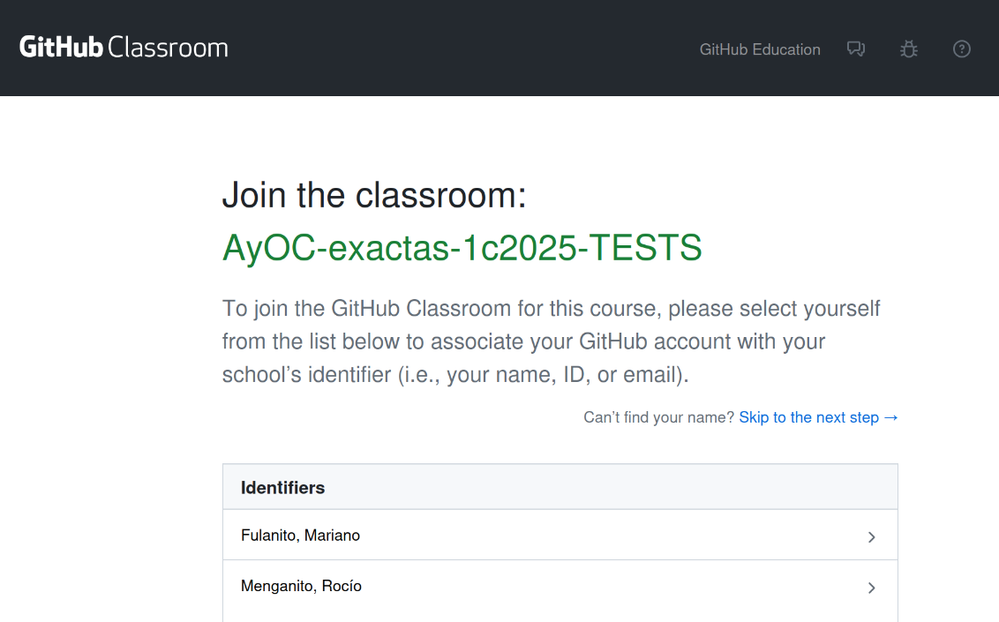
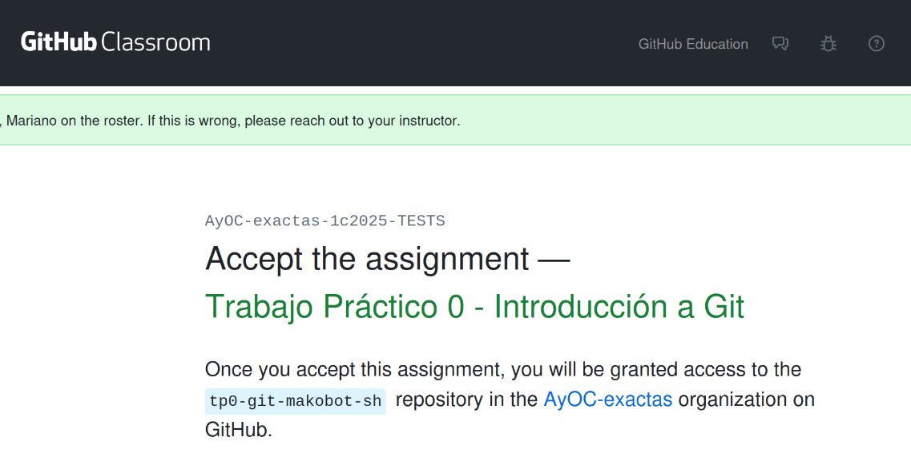

# Arquitectura y Organización del Computador
Bienvenides 👋 al espacio de github de la materia Arquitectura y Organización del Computador (ex. Orga2) del Departamento de Computación de la Facultad de Ciencias Exactas y Naturales, UBA.

En esta organización se concentran las guías y trabajos prácticos de la materia.

----

# Inscripción al classroom

Utilizaremos [Github Classrooms](https://classroom.github.com/classrooms) para los trabajos prácticos de la materia. 
Para unirse al classroom del cuatrimestre deberán utilizar los links provistos por la cátedra en el discord privado de la materia.

Al ingresar al link de algún Trabajo Práctico por primera vez, aparecerá una página para asociar el usuario de github activo con su nombre. **Es importante que su nombre figure en esta pantalla**, de no hacerlo pueden presionar para saltar al siguiente paso, pero **deben informarnos que no pudieron asociar su nombre** o no podremos considerar la posterior entrega como válida.

Una vez seleccionado el nombre correspondiente, aparecerá en la parte superior de la siguiente pantalla un mensaje de confirmación con la siguiente pinta:

De no figurar el nombre correcto en esta mensaje, **deben avisar a la cátedra a la brevedad**. Pueden contactarnos por correo a `orga-doc@dc.uba.ar`.

Finalmente, aparecerá la página para aceptar el trabajo práctico correspondiente. 
Al aceptar el trabajo práctico, se les creará una copia personal del repositorio con el enunciado y código del trabajo práctico. 
Los docentes tendrán acceso a esta copia automáticamente.

Con su copia del repositorio creada correctamente, ya están listos para comenzar a trabajar!